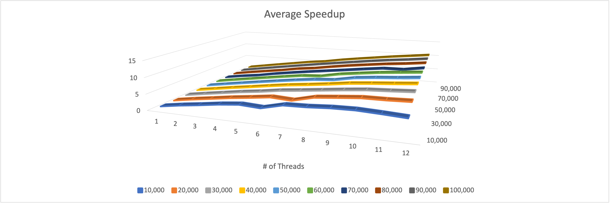
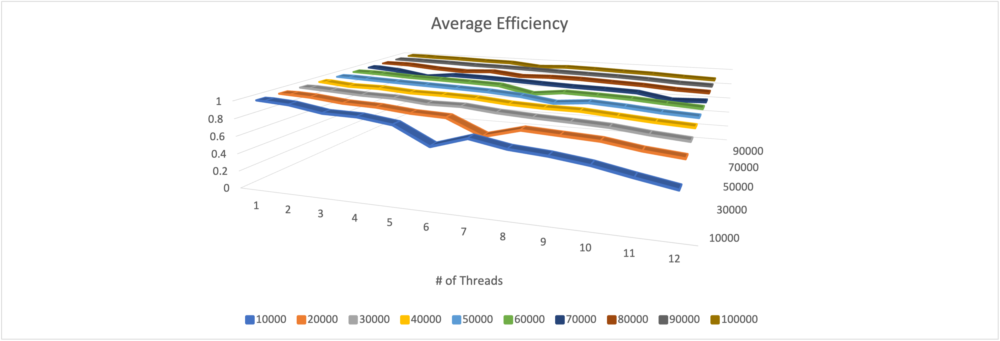
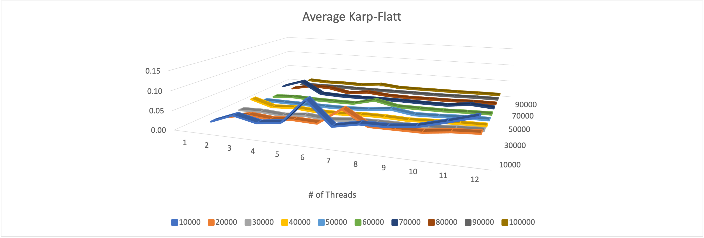

# Parallel Count Sort in Parallel

## To run
cd Default && make all
./OpenMP

## Reflection
In this project I used OpenMP a open source library for parallel computing.
I used omp for scheduling for the first time, and instead of only using omp for loops I created a thread pool and used omp for to direct when the threads should fork.

## Analysis
In my spreadsheet titled "R03_results.xlsx" there are 3 tables containing the average speedup, average efficiency, and average Karp-Flatt metric.

## Speedup

Speedup is a measure of your programs speed when run in parallel vs when run in serial. My program achieves ~10x faster execution time when using all 12 threads.
This Speedup approaches linear Speedup and is 

## Efficiency

Efficiency is a measure of how much of your processing resources are being used. With higher problem sizes and more threads my program stays above 0.8 Efficiency.

## Karp-Flatt

The Karp-Flatt metric is a measure of how much of your program is parallel vs serial. My program has a higher Karp-Flatt metric with lower problem sizes and decreases with problem size.
